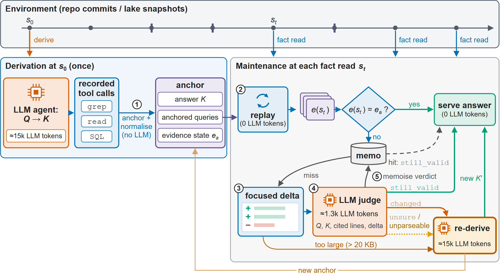
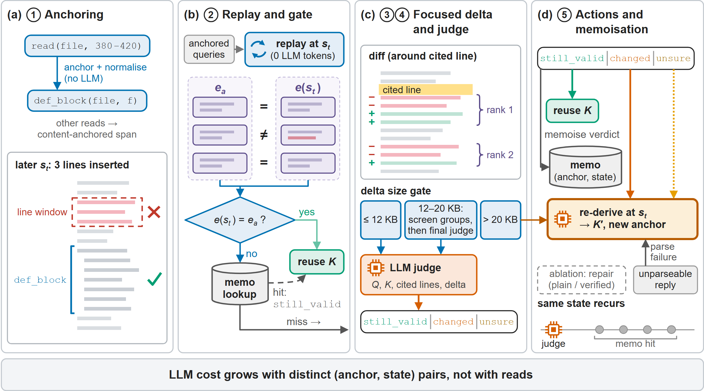

# Evidence-State Maintenance (ESM)

Code, benchmarks and result records for

> **Maintaining Agent-Derived Knowledge under Environment Drift: An Evidence-State Approach for Persistent LLM Agents**
> [Authors to be added]. Submitted to *Expert Systems with Applications*.

ESM keeps facts that an LLM agent derived from a changing environment valid: it replays the recorded tool calls
behind a fact in a drift-robust form, reuses the fact while this evidence state is unchanged, and otherwise lets an
LLM judge only the change, re-deriving when needed. Over 400 real commits of 16 held-out Python repositories, ESM
serves a wrong answer on 5.8 % of reads, against 21.5 % for blind reuse.



A fact is derived once and stored with its anchored queries and evidence state. At each later read the queries are
replayed without an LLM; only a changed state reaches the LLM judge, and its verdict is memoised.



The steps in detail: anchoring, replay and gate, focused delta and judge, actions and memoisation.

## Contents

```
esm/                 the ESM package, stage scripts and experiment drivers
  results/<stage>/   RESULTS.md, tables, figures and per-read records of every experiment
heldout/             builder of the held-out code benchmark (16 repositories, 1,478 facts)
datalake/            builder of the two evolving data lakes (NYC TLC, Backblaze Drive Stats; 344 facts)
data/                held-out oracle tables, data-lake source catalogue, GitHub issue arrival times
inputs/              frozen fact subsets, frozen policy choice, model settings, task definitions
provenance/          historical job logs of the original runs
paper_figures/       make_figs.py and the figures of the paper
tests/               smoke tests (no GPU, no network)
```

`REPRODUCING.md` explains what can be reproduced at which cost, with the commands for every experiment and a map from
paper sections to code and results. `MODEL_MANIFEST.json` lists the exact model builds, and `DATA_LICENSES.md` the
third-party data.

## Installation

Python 3.14 and git are required (the held-out oracles parse code with the interpreter's `ast` module, so other
versions can change ground truth).

```bash
git clone https://github.com/sonaradarcn/evidence-state-maintenance.git
cd evidence-state-maintenance
python -m venv .venv && . .venv/bin/activate      # Windows: .venv\Scripts\activate
pip install -r requirements.txt
python -m pytest tests                            # checks the headline numbers from the shipped records
```

Run all commands from the repository root. On Windows also set `PYTHONIOENCODING=utf-8`.

## Main results

Served-wrong rate: share of reads at which the served answer differs from the oracle. Tokens are LLM tokens,
construction included. Intervals and further policies are in the `RESULTS.md` files.

| experiment (paper section) | setting | ESM | blind reuse | other policies |
|---|---|---|---|---|
| held-out benchmark (7.1) | 1,419 facts, every commit of 400 | **5.8 %**, 26.5k tokens/fact | 21.5 % | |
| same, referent present (7.1) | 87.4 % of reads | 0.7 % | 10.2 % | |
| real-cost comparison (7.2) | S160 (160 facts; `H150` in code), same 27B re-deriver | 6.9 % @ 26.5k | 28.8 % | CERT-ZS 7.1 % @ 53k, LLMDIFF 8.1 % @ 72k, REPLAY 8.5 % @ 162k, TTL100 14.6 % @ 44k |
| natural sample (7.2) | NAT100 | 5.5 % | 14.4 % | CERT-ZS 5.5 %, REPLAY 5.6 %, LLMDIFF 6.4 %, TTL100 7.7 % |
| second model (7.3) | Nemotron-120B, 30 facts | 7.3 % | 29.3 % | TTL100 15.4 % |
| data lake, Backblaze (7.6) | 57 facts, 105 snapshots | 8.2 % | 20.4 % | TTL20 with oracle re-derivation 8.4 % |
| data lake, TLC (7.6) | 115 facts, 229 snapshots | 21.1 % | 33.5 % | TTL25 with oracle re-derivation 11.5 % |
| task stream (7.7) | S160, real issue arrivals | 10.6 % of tasks @ 370 tokens/task | 38.6 % | CERT-ZS 10.1 % @ 662, LLMDIFF 9.2 % @ 689, REPLAY 13.4 % @ 1,778 |
| code tasks (7.8) | 120 tasks, success rate | 95.0 % @ 17.2k tokens/task | 92.5 % | TTL100 95.0 % @ 24.4k; no memory 93.3 % @ 11.2k |
| data-lake tasks (7.8) | 63 tasks, success rate | 79.4 % @ 50.9k tokens/task | 74.6 % | TTL 77.8 % @ 76.3k; no memory 76.2 % @ 43.2k |

The paper also reports where ESM does not pay off: on append-driven running aggregates, where the re-derivation
itself is the bottleneck, and on facts so cheap to derive that an agent without memory is as accurate and cheaper.

## Citation

```bibtex
@article{esm2026,
  title   = {Maintaining Agent-Derived Knowledge under Environment Drift: An Evidence-State Approach for Persistent LLM Agents},
  author  = {Authors to be added},
  journal = {Expert Systems with Applications},
  note    = {Submitted},
  year    = {2026}
}
```

## License and acknowledgements

Code and documentation: MIT (`LICENSE`). Derived data keeps the terms of its sources (`DATA_LICENSES.md`).
Parts of the code and documentation were written with the help of LLM coding assistants and reviewed by the authors.
